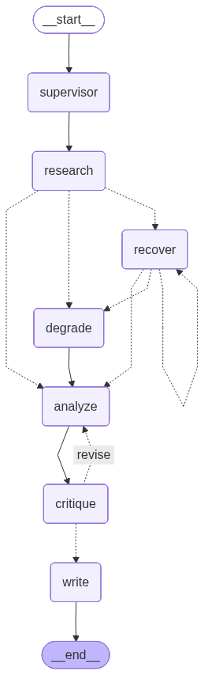

# Maestro — Architecture

> **Maestro is a supervisor-orchestrated multi-agent system with visible delegation and recovery.**
>
> A supervisor agent decomposes a goal into subtasks at runtime and delegates each to a
> role-specialized subagent (Researcher, Analyst, Critic, Writer), each with its own context.
> Independent subtasks run in bounded parallel; a Critic subagent can reject and return work
> until it passes; subagent failures recover visibly (retry → re-delegate → degrade); and every
> run is replayable node-by-node. Built on LangGraph, runs on the Gemini free tier with
> exponential backoff and a concurrency cap.

This document explains the structure. `graph.png` is regenerated from the compiled graph by
`python scripts/render_graph.py`.

---

## The graph



```
START → supervisor → research ─┬─▶ analyze ─▶ critique ─┬─(PASS / ceiling)─▶ write → END
                               │                        │
                    (failed)   ├─▶ recover ⟳ (retry)    └─(REJECT & under ceiling)─▶ analyze
                               │       │
                    (exhausted)└─▶ degrade ─▶ analyze
```

Every edge above is a real LangGraph edge (see `maestro/graph.py`). The dotted edges in the
diagram are **conditional** edges driven by router functions; solid edges are unconditional.

| Node | Responsibility |
|---|---|
| `supervisor` | **Dynamic decomposition** (§ below): asks the LLM for a structured plan; recalls prior findings from long-term memory. |
| `research` | Runs the researcher subtasks with **bounded parallelism** via `scheduler.run_schedule`. |
| `recover` / `degrade` | **Visible recovery** of failed researchers: retry → re-delegate → degrade, bounded by `MAX_RECOVERY_ATTEMPTS`. |
| `analyze` | The Analyst synthesizes evidence (+ recalled memory) into a draft; re-entered on critic rejection to revise. |
| `critique` | The Critic reviews the draft and PASSes or REJECTs with feedback. |
| `write` | The Writer composes the final cited brief; persists distilled findings to memory. |

---

## Why the supervisor pattern, and why LangGraph

The supervisor pattern **is** a graph: a controller node that routes to specialist nodes, over a
shared typed state, with conditional edges for delegation, the critic loop, and recovery. Once a
system needs runtime routing between multiple agents, a critic loop that sends work back, bounded
parallel branches, and recovery edges, hand-rolling that coordination means reinventing a
graph/state engine — badly. LangGraph is purpose-built for exactly this: `StateGraph` with named
nodes, a typed shared state with per-channel reducers, conditional edges, and streaming.

The interesting engineering here is not the framework; it is making the coordination
**observable, recoverable, and honestly multi-agent**. LangGraph handles the graph mechanics so
the build concentrates on those hard parts.

---

## The shared state (`maestro/state.py`)

A `TypedDict` flows through the graph. List channels that receive concurrent writes from the
bounded-parallel research branches carry **reducers** so parallel updates merge instead of
clobbering:

- `subtasks: Annotated[list[Subtask], merge_subtasks]` — merged **by id**, so two researchers
  updating their own subtasks in parallel don't overwrite the plan.
- `evidence`, `critic_verdicts`, `trace: Annotated[..., append_list]` — concatenated across branches.
- scalars (`step_count`, `critic_iterations`, `recovery_attempts`, `analysis`, `final_output`,
  `status`) are written by single (non-parallel) nodes → last-write-wins.

The `Subtask` model with its `depends_on` list is the spine: it makes decomposition *dynamic* and
scheduling *dependency-aware*.

---

## Dynamic decomposition (`maestro/supervisor.py`)

The supervisor prompts Gemini with the goal + the specialist roles and asks for a **structured
Pydantic `Plan`** (not free text): subtasks each with a description, an assigned role, and a
`depends_on` list. `validate_and_build` rejects malformed plans (duplicate/unknown/self refs,
cycles, size > `MAX_SUBTASKS`). Different goals produce structurally different plans — verified
live: *"Compare solar vs wind"* and *"PostgreSQL vs MongoDB"* yield different subtask graphs.

A deterministic `heuristic_planner` is provided for offline runs/tests; it is a fallback, not the
headline — the "dynamic decomposition" claim rests on the LLM planner.

---

## Bounded parallelism (`maestro/scheduler.py`)

`run_schedule` is a rolling executor: it keeps up to `MAX_PARALLEL` researcher subtasks in flight
(thread pool), refilling as each finishes, while dependent subtasks wait. It observes the actual
maximum concurrency so the parallelism claim is measurable. The cap is **both** the parallelism
signal and the rate-limit guard — with the Gemini free tier at ~10 RPM, unbounded fan-out would
hit 429s immediately, so `MAX_PARALLEL` defaults to **2**.

Readiness primitives (`ready_subtasks`, `next_batch`) are shared between the executor and the graph.

**Threads, not LangGraph `Send`.** The rejected alternative was a `Send`-based fan-out (dynamic
graph branches per researcher). An internal thread pool was chosen instead because it keeps the
concurrency cap, the recovery ladder, and per-subtask streaming inside one node with a single
enforced choke point — the free tier's rate-limit guard — rather than spread across dynamically
created branches; the trade-off is that the fan-out is invisible to the graph, so `research`
renders as one node (the parallelism is *inside* it, not a graph-level branch).

---

## The critic loop (`maestro/agents/critic.py`)

After the Analyst drafts, the Critic reviews it against the evidence and returns a structured
verdict: **PASS**, or **REJECT + specific feedback**. On REJECT the `critique → analyze` edge
routes the draft back to the Analyst, which revises using the feedback; the Critic reviews again.
Bounded by `MAX_CRITIC_ITERS`; on the ceiling it degrades gracefully (best draft, flagged
"not fully validated"). A genuine LLM critic can reject on its own; `force_critic_reject` makes a
rejection reliably triggerable for the demo.

---

## Visible recovery (`recover` / `degrade` nodes)

When a researcher reports a **structured failure** (tools never raise raw into the graph), the
supervisor climbs an explicit, logged ladder:

1. **retry** with backoff (bounded),
2. **re-delegate** the subtask,
3. **degrade** — mark it "could not complete", proceed on partial evidence, flag it in the output.

Each choice is a `recovery` / `degraded` trace event. Bounded by `MAX_RECOVERY_ATTEMPTS`.

---

## Loop & cost control (`maestro/loop_control.py`)

Multi-agent systems loop and multiply cost, so bounding them is a feature. Three explicit bounds
live in the routers — `MAX_CRITIC_ITERS`, `MAX_RECOVERY_ATTEMPTS`, and the global `MAX_STEPS`
backstop — plus two loop detectors as defense-in-depth: a critic giving identical feedback with no
progress, and a subtask re-dispatched too many times. A `MAX_STEPS` / loop-detector halt is
labelled distinctly (`status = halted`) from a graceful degrade.

---

## Rate-limit resilience (`maestro/resilience.py`)

Every LLM/tool call goes through `resilient_call` — exponential backoff + jitter (tenacity).
Retries cover rate limits (429 / RESOURCE_EXHAUSTED / quota) **and** transient server/network
errors (503, 5xx, connection/timeouts) — the latter added after a live run hit a Gemini 503
"high demand". Retries are logged to the trace, so "handles provider rate limits gracefully" is a
signal you can point to, not a silent behavior.

---

## Memory (`maestro/memory/`)

| Layer | Lifetime | Backing |
|---|---|---|
| **Working** | one run | graph state (`evidence`, `subtasks`, `analysis`, …) |
| **Long-term** | across turns of a thread | FAISS inner-product index + local embeddings |

On completion the graph writes distilled findings (the analysis claims) tagged with `thread_id`;
on a later turn the supervisor recalls them during planning (`memory_hits`) and the Analyst uses
them. The embedder is swappable: `SentenceTransformerEmbedder` (`bge-small`, production, free) or
`HashingEmbedder` (deterministic, no-torch, tests). Verified live: turn-2 recalled turn-1 findings
by semantic similarity (cosine ~0.72–0.75) and the brief visibly incorporated them.

---

## Observability (`maestro/trace.py`)

Every meaningful transition appends a `TraceEvent` (plan_produced, subtask_dispatched,
subagent_result, critic_pass/reject, recovery, degraded, memory_recall/write, halted, completed).
On completion the full run is persisted to SQLite keyed by `run_id` and is **replayable
node-by-node** afterward, exportable as JSON, and queryable (`query_events`). This is the
production-thinking signal: a full audit log you can reconstruct after the fact.

---

## The service (`maestro/serve.py`)

- `POST /run` — `{goal, thread_id?}`; **streams** the coordination as SSE (plan → dispatch →
  subagent results → critic verdicts → recovery → final).
- `GET /healthz` — liveness.
- `GET /runs`, `GET /runs/{run_id}` — list and export replayable traces.

`thread_id` groups turns and long-term memory. Every run is persisted; each request logs run id,
status, and the step/critic/recovery counters.

---

## Configuration (`maestro/config.py`)

All tunables in one place, env-overridable with the `MAESTRO_` prefix:

| Setting | Default | Purpose |
|---|---|---|
| `model_id` | `gemini-3.5-flash` | Gemini model (verified live; `gemini-3.1-flash-lite` is the higher-RPM fallback) |
| `embedding_model` | `BAAI/bge-small-en-v1.5` | local, free long-term-memory embeddings |
| `max_parallel` | 2 | concurrency cap (rate-limit guard) |
| `max_subtasks` | 6 | plan-size bound |
| `max_steps` | 40 | global loop backstop |
| `max_critic_iters` | 3 | critic-loop ceiling |
| `max_recovery_attempts` | 2 | recovery ceiling |
| `fault_injection` / `force_critic_reject` | off | make recovery / rejection demoable on demand |

---

## Architectural invariants (do not violate)

1. **Separate contexts** — each subagent has its own prompt and sees only its task + relevant
   structured inputs. The only cross-agent hand-off is structured data via the supervisor.
2. **Runtime delegation** — the plan is LLM-produced per goal, never a hardcoded pipeline.
3. **A critic that can disagree** — rejection is real and triggerable on demand.
4. **Bounded parallelism** — concurrency capped; never fan out unbounded.
5. **Backoff on every call** — no LLM/tool call is unwrapped.
6. **Ceilings enforced** — `MAX_STEPS` / `MAX_CRITIC_ITERS` / `MAX_RECOVERY_ATTEMPTS`.
7. **Structured failures** — tools never raise raw into the graph; the supervisor decides meaning.
8. **Everything traced** — no coordination decision is invisible.
